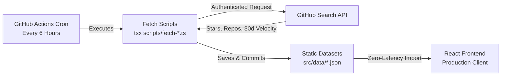

# DevSec Status

<div align="center">


**Real-time statistics, popularity & momentum tracker for Programming Languages, Frameworks, Databases, and Open Source Cybersecurity Tools.**

[](https://opensource.org/licenses/MIT)
[](https://www.typescriptlang.org/)
[](https://react.dev/)
[](https://vitejs.dev/)
[](https://tailwindcss.com/)
[](https://github.com/sercanvr/devsec-status/actions)

</div>

---

## Overview

**DevSec Status** is an open-source developer intelligence dashboard designed to monitor the growth, developer adoption, repository volume, and velocity of major programming languages, modern frameworks, database engines, and cybersecurity toolkits.

Combining GitHub Search API metrics with a financial-grade **Fintech & Stock-Terminal UI**, DevSec Status visualizes technology popularity through interactive segmented metric bars, blueprint-styled architectural showcase heroes, dynamic community contributor stacks, and real-time search filtering.

---

## Tech Stack

| Layer | Technology | Description |
|---|---|---|
| **Framework** | [React 19](https://react.dev/) | Core UI rendering with concurrent React features |
| **Bundler & Tooling** | [Vite 6](https://vitejs.dev/) & [TypeScript 5](https://www.typescriptlang.org/) | Next-generation frontend tooling and strict type checking |
| **Styling** | [Tailwind CSS 3](https://tailwindcss.com/) | Modern utility-first styling with custom glassmorphism and animations |
| **Routing** | [React Router 7](https://reactrouter.com/) | Client-side routing between Software and Security pages |
| **Localization (i18n)** | [i18next](https://www.i18next.com/) & [react-i18next](https://react.i18next.com/) | 9 languages (English, Turkish, German, French, Spanish, Italian, Portuguese, Russian, Chinese) with automatic browser detection |
| **Icons & Media** | [Lucide React](https://lucide.dev/) & WebP | Crisp scalable vector icons and lightweight WebP graphics |
| **Security & Sanitization** | [DOMPurify](https://github.com/cure53/DOMPurify) | Strict XSS sanitization for all rendered dynamic and static strings |
| **Testing** | [Vitest](https://vitest.dev/) & [Testing Library](https://testing-library.com/) | Blazing-fast unit and component test suite |
| **Automation** | [GitHub Actions](https://github.com/features/actions) & `tsx` | Automated scheduled GitHub API fetch workflow every 6 hours |

---

## Key Features

- **Fintech & Stock-Terminal UI**: Technology metrics visualized through 20-segment capsule progress bars with adaptive color tiers (Cobalt Blue, Emerald, Amber, Rose).
- **Blueprint Architecture Showcase**: High-impact hero container featuring SVG blueprint vectors, interactive sparkline charts, growth ratios, and a central orbital tech hub.
- **Granular Category Tables**: Software ecosystem organized into 3 distinct, uncluttered tables:
  - *Programming Languages* (24 core languages: Python, Rust, TypeScript, Go, C++, etc.)
  - *Frameworks & Libraries* (11 modern stacks: React, Next.js, FastAPI, Vue, etc.)
  - *Database Technologies* (11 relational, NoSQL, and vector engines: PostgreSQL, Redis, Supabase, MongoDB, SQLite, etc.)
  - *Cybersecurity Tools* (Reverse engineering, SAST/DAST, scanners, and exploit frameworks: Ghidra, Metasploit, Nmap, Trivy, Nuclei, ZAP, etc.)
- **Expandable Community Drawer**:
  - Top 4 live GitHub contributors with interactive avatar cards and profile links
  - Top starred new repository of the month
  - Total ecosystem repository count and official release dates
  - Direct external repository navigation
- **Instant Search & Tag Filtering (`⌘K` / `Ctrl+K`)**: Global search modal supporting fuzzy name search, categories, creators, and hashtag syntax (e.g. `#framework`, `#systems`).
- **Multilingual Support (9 Languages - EN / TR / DE / FR / ES / IT / PT / RU / ZH)**: Instant switching across 9 global languages with zero-delay CDN-optimized WebP flag preloading and persistent storage.
- **Dark & Light Mode**: Seamless theme switching with persistent storage and system preference detection.
- **Zero Client Rate Limits**: Metrics are pre-fetched via automated GitHub Actions and baked into static JSON, guaranteeing instant page loads without GitHub 403 API rate errors.
- **AI Agentic & Search Engine Ready**: Built-in `sitemap.xml`, `robots.txt`, `llms.txt`, and `ai-catalog.json` for autonomous AI agents and web crawlers.
- **Responsive Standard**: Tested and optimized across Mobile (`390 x 844 px`), Tablet (`768 x 1024 px`), Laptop (`1366 x 768 px`), and Desktop (`1920 x 1080 px`).

---

## Project Structure

```
devsec-status/
├── .github/
│   └── workflows/
│       └── update-data.yml          # Automated 6-hour cron workflow for GitHub API sync
├── public/
│   ├── icons/                       # WebP brand logos, favicon, and country flags
│   ├── ai-catalog.json              # Structured manifest for autonomous AI agents
│   ├── llms.txt                     # Semantic dataset documentation for LLM ingestion
│   ├── robots.txt                   # Crawler directives
│   └── sitemap.xml                  # SEO URL index
├── scripts/
│   ├── curated-lists/               # Target technology definitions and metadata
│   ├── fetch-languages.ts           # GitHub Search API crawler for languages
│   ├── fetch-frameworks.ts          # GitHub Search API crawler for frameworks
│   ├── fetch-databases.ts           # GitHub Search API crawler for databases
│   └── fetch-security-tools.ts      # GitHub Search API crawler for security tools
├── src/
│   ├── components/
│   │   ├── HeaderShowcase.tsx       # 3-column blueprint hero showcase card
│   │   ├── TechTable.tsx            # Modern fintech table with search, sort & drawers
│   │   ├── SegmentedProgressBar.tsx # 20-capsule segmented metric bar
│   │   ├── TechBar.tsx              # Standalone tech card component
│   │   ├── Navbar.tsx               # Navigation bar with search shortcut & theme toggle
│   │   ├── Footer.tsx               # Dynamic last-updated footer with GitHub star CTA
│   │   ├── SearchModal.tsx          # Keyboard-navigable quick search modal (Ctrl+K)
│   │   ├── LanguageSwitcher.tsx     # Instant language switcher with preloaded WebP flags
│   │   ├── ProximitySidebar.tsx     # Quick section anchor sidebar
│   │   ├── ScrollToTopButton.tsx    # Smooth scroll-to-top floating button
│   │   ├── Skeleton.tsx             # Sunken well skeleton loader with metallic sheen
│   │   ├── ui/
│   │   │   └── skeleton.tsx         # Primitive Skeleton components (Block, Text, Circle, Swap)
│   │   └── CardSkeleton.tsx         # High-fidelity card shimmer loading skeleton
│   ├── data/                        # Static synced datasets (languages, frameworks, etc.)
│   ├── hooks/
│   │   ├── useGitHubContributors.ts # Contributor avatar resolver with fallback cache
│   │   └── useTheme.ts              # Dark/light theme state manager
│   ├── i18n/                        # 9 localization dictionaries (en, tr, de, fr, es, it, pt, ru, zh)
│   ├── lib/
│   │   └── sanitize.ts              # DOMPurify text and URL sanitization helpers
│   ├── pages/
│   │   ├── SoftwarePage.tsx         # Main software ecosystem page (3 distinct tables)
│   │   └── SecurityPage.tsx         # Cybersecurity tools and SecOps page
│   ├── types/
│   │   └── tech.ts                  # Core TypeScript interfaces for technologies & metrics
│   ├── App.tsx                      # Application root and route configuration
│   ├── main.tsx                     # React DOM entry point
│   └── index.css                    # Tailwind CSS directives and custom styling tokens
├── tests/
│   ├── TechTable.test.tsx           # Unit tests for fintech table filtering and expansion
│   ├── TechBar.test.tsx             # Unit tests for technology row rendering
│   └── setup.ts                     # Jest DOM test environment setup
├── package.json
├── tailwind.config.js
├── tsconfig.json
└── vite.config.ts
```

---

## Data Pipeline & Architecture

DevSec Status avoids client-side GitHub API rate limits (60 requests/hour unauthenticated) by employing a **Static Build Data Sync** pattern:



1. **Scheduled Sync**: A GitHub Actions workflow triggers every 6 hours (`0 */6 * * *`).
2. **API Query**: `scripts/fetch-*.ts` requests repository search metrics, stars, and creation velocity using `GITHUB_TOKEN`.
3. **Commit & Push**: Updated metrics are verified and committed back to `src/data/*.json`.
4. **Instant Client Delivery**: Users receive data immediately from static files with 0 ms API delay and 100% uptime.

---

## Getting Started

### Prerequisites

- [Node.js](https://nodejs.org/) (version 20.x or higher recommended)
- [pnpm](https://pnpm.io/) (version 10.x recommended)

### Installation

1. **Clone the repository**:
   ```bash
   git clone https://github.com/sercanvr/devsec-status.git
   cd devsec-status
   ```

2. **Install dependencies**:
   ```bash
   pnpm install
   ```

3. **Configure Environment Variables (Optional for local data fetching)**:
   Create a `.env` file in the project root if you wish to run the data collection scripts locally:
   ```env
   GITHUB_TOKEN=ghp_your_personal_access_token_here
   ```
   *(Note: The web application itself runs entirely without environment variables as it reads from the pre-populated datasets).*

4. **Start the development server**:
   ```bash
   pnpm dev
   ```
   Open [http://localhost:5173](http://localhost:5173) in your browser.

---

## Available Scripts

| Command | Description |
|---|---|
| `pnpm dev` | Starts the Vite local development server with hot module replacement (HMR) |
| `pnpm build` | Type-checks with `tsc` and builds production bundle to `dist/` |
| `pnpm preview` | Serves the production build locally for verification |
| `pnpm lint` | Performs strict TypeScript type checks across all `.ts` and `.tsx` files |
| `pnpm test` | Runs the Vitest test suite once |
| `pnpm run fetch:data` | Executes all 4 data crawlers to refresh static JSON files from GitHub |

---

## Testing

The project uses [Vitest](https://vitest.dev/) with [React Testing Library](https://testing-library.com/docs/react-testing-library/intro/) for unit and integration testing.

To execute tests:
```bash
pnpm test
```

---

## Contributing

Contributions are welcome! Please follow these steps:

1. Fork the repository.
2. Create a feature branch: `git checkout -b feat/your-feature-name`.
3. Commit your changes adhering to [Conventional Commits](https://www.conventionalcommits.org/): `git commit -m "feat: add your feature"`.
4. Push to your branch: `git push origin feat/your-feature-name`.
5. Open a Pull Request.

---

## License

This project is licensed under the **MIT License** — see the [LICENSE](LICENSE) file for details.

Copyright (c) 2026 **Sercan Var**.
